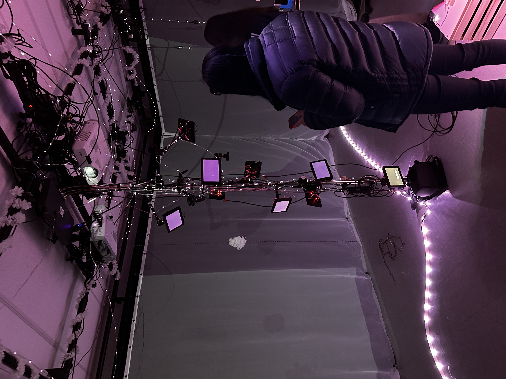
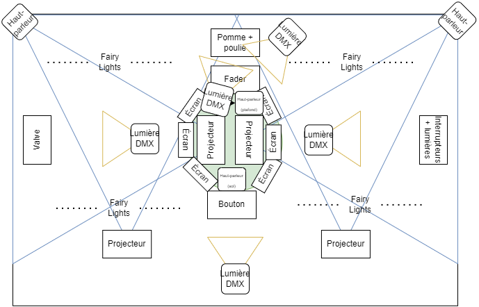
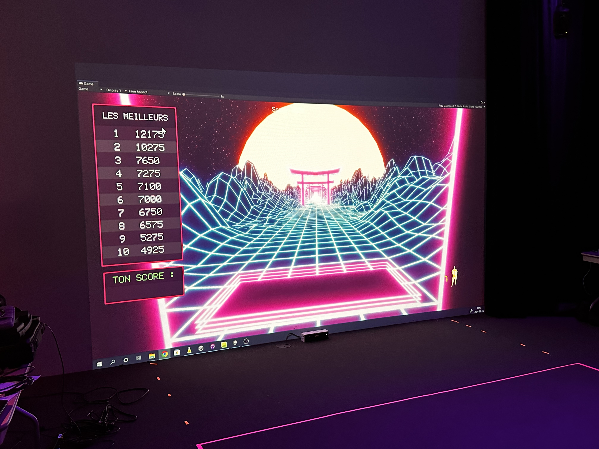
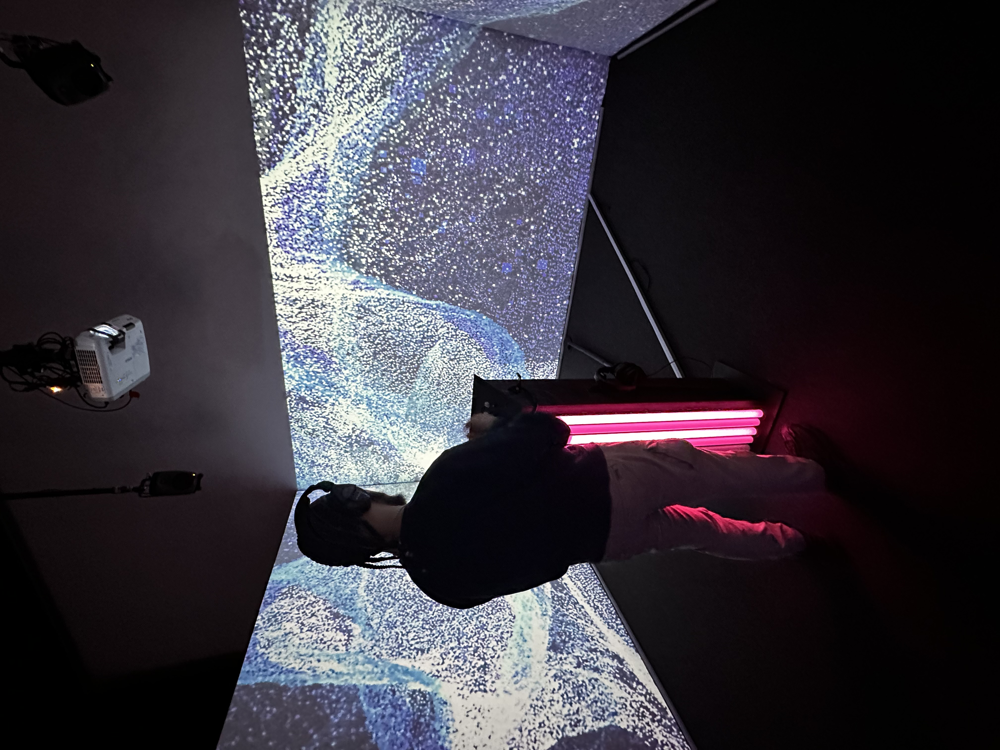

# Projet 1: Rhizomatique - l'humain et le temps

 
 
 **Créateurs**: Jolyanne Desjardins, Maïka Désy, Laurie Houde & Félix Testa Radovanovic  
 
 **Lien avec Crescentia**:  Le concept de Crescentia met en avant l'évolution sous plusieurs facettes, incluant l'aspect organique,  environnemental et psychologique. "Rhizomatique" explore cette idée en reliant l'humain et le temps. Ce projet met en lumière la croissance et l'évolution des souvenirs, qui se manifestent de manière dynamique et changeante au gré des interactions des visiteurs. 
 
 **Installation en cours**:  Cette exposition fascinante offre une expérience immersive unique, mettant en scène une toile qui symbolise le "cerveau", servant de lien entre l'interacteur et les souvenirs, ainsi que des projections immersives présentées à travers des vidéos. La toile joue également un rôle crucial en contrôlant la clarté des souvenirs, les rendant visibles sous forme de particules. À mesure que l'interaction avec la toile s'intensifie, la netteté des souvenirs s'accroît. Cette toile, métaphore du cerveau, projette des fluides et évoque l'aspect rhizomatique de cette structure complexe.

  
 **Schéma de l'installation prévue**:  Voici le schéma initial utilisé par l’équipe. On remarque qu’ils avaient prévu d’utiliser 3 projecteurs. Cependant, lors de l’exposition, ils ont dû augmenter ce nombre à 6 car trois n'étaient pas suffisants pour leur œuvre. En dehors de cette modification, le reste du plan semble avoir été suivi selon les attentes.

**Recenti Anticipé**:  "Rhizomatique" est une œuvre immersive et captivante qui explore de manière inventive la relation entre l'humain, le temps et la mémoire. En utilisant une toile interactive et des projections, les créateurs offrent une expérience où les visiteurs peuvent explorer les souvenirs d'une manière nouvelle. L'interaction avec la toile influence la clarté des souvenirs, et l'équipe a su s'adapter en ajoutant plus de projecteurs lors de l'exposition. En résumé, "Rhizomatique" est une expérience enrichissante qui invite à réfléchir sur nos souvenirs et notre perception du temps de façon nostalgique et intéressante. 

# Projet 2: Effet Papillon, Le pommier

**Créateurs** : Raphaël Dumont, Alexis bolduc, William Morel, Alexia (ryan) Papanikolaou, Viktor Zhuravlev et Jasmine Lapierre  

**Lien avec Crescentia** :  Comme Crescentia met en avant le concept d'évolution sous diverses formes, y compris organique et environnementale, ce projet illustre la croissance et l'évolution d'un pommier, de la graine à la pomme. Il reflète ainsi le cycle naturel de la vie et la croissance de cette arbre. 

**Installation en cours**:  L'exposition s'est déroulée dans un studio où l'équipe a créé de façon immersive la représentation médiatique d'un pommier en pleine croissance. Pour instaurer une ambiance naturelle, trois projecteurs diffusaient des vidéos de paysages naturels. L'arbre était élaboré à partir d'un long poteau entouré de fils et de petits écrans, représentant respectivement les "branches" et les "feuilles" de l'arbre.

**Schéma de l'installation prévue**:

Le schéma initial n'a pas pu être entièrement réalisé en raison des difficultés rencontrées par l'équipe tout au long de l'exposition. En effet, certains écrans ne fonctionnaient pas correctement et n'étaient pas totalement opérationnels.

**Recenti Anticipé**:  L’exposition avait du potentiel mais malheureusement avec des éléments qui semblaient mal préparés et mal fonctionner, les problèmes techniques ont gâché l'expérience. On avait l'impression que l'équipe n'avait pas pris le temps de peaufiner les détails

# Projet 3: Kigo, Le jeu

**Créateurs**: Éric Ouellette, William Rhatier Mailly, Gabriel Clerval, Nicholas St-Martin et Antoine Dion

**Lien avec Crescentia**:  Comme Crescentia met en avant le concept d'évolution sous diverses formes, y compris organique, environnementale et psychologique, ce jeu interactif illustre l'évolution du joueur à travers différents niveaux et défis. De plus, le changement esthétique associé aux quatre saisons reflète également la croissance et l'évolution de l'environnement virtuel.

**Installation en cours**:  Cette exposition est une expérience multimédia interactive qui prend la forme d'un jeu intitulé "Kigo" qui met en scène les saisons. L'objectif sera de parcourir quatre niveaux de difficulté croissante, représentant chacun une saison différente. Les décors du jeu reflètent les caractéristiques distinctives de chaque saison, offrant ainsi une immersion totale dans l'environnement virtuel. Chaque niveau présentera des défis spécifiques en fonction de la saison correspondante, allant de facile à très difficile. L'interaction avec le jeu sera rendue possible grâce à la technologie Kinect, qui capturera les mouvements du joueurs. Cela permettra à l'avatar de se déplacer latéralement en fonction de ses mouvements, ainsi que de s'accroupir pour esquiver les obstacles qui se présentent à lui. Cette approche interactive offrira une expérience de jeu dynamique et engageante, où le joueur devra utiliser ses compétences physiques pour progresser à travers les niveaux.

**Schéma de l'installation prévue**:  Le plan a été respecté car l’installation ressemble beaucoup au schéma initial. Cependant, j'ai remarqué que l'espace réservé au joueur était plus restreint que celui indiqué sur le schéma.

 
**Recenti Anticipé**:   Le projet Kigo offre une expérience amusante et immersive, où les joueurs sont transportés à travers les quatre saisons dans des environnements visuellement captivants. La technologie Kinect permet une interaction physique qui ajoute une étendue supplémentaire à l'expérience, offrant aux joueurs une immersion totale dans le monde du jeu. C'est une expérience divertissante qui combine habilement technologie et jeu pour offrir aux visiteurs une aventure mémorable et enrichissante.

# Projet 3: Sonalux, Dépasse les limites du réel 

**Créateurs** : Antoine Heddad, Camélie Laprise, Ghita Alaoui et Vincent Desjardins 

**Lien avec Crescentia** :  Tout comme les œuvres de Crescentia, qui évoluent et se transforment au gré des actions des visiteurs, Sonalux offre une expérience en constante évolution. Les visiteurs deviennent acteurs de leur propre voyage astral collectif, façonnant ainsi l'expérience à travers leur interaction avec les pièces d'instruments sur le podium.

**Installation en cours**:  L'exposition est animée par trois écrans en fonctionnement, diffusant des animations captivantes qui transportent les visiteurs dans un autre univers. Au centre de la scène, trône une "boîte à musique" interactive, permettant aux visiteurs de contrôler le son et de composer leur propre musique. Cette boîte renferme l'ensemble du mécanisme de l'œuvre, offrant ainsi une expérience immersive et personnalisée.

**Schéma de l'installation prévue**: 

Le plan a été globalement respecté, bien que quelques différences soient à noter. L'installation présentée était similaire au schéma initial, mais les écrans étaient proportionnés différemment et il y avait moins de projecteurs que prévu.

 **Recenti Anticipé**:  Sonalux offre une expérience artistique et immersive qui transcende les limites de la réalité. Plongeant les visiteurs dans un monde artistique, cette installation nous a laisser nous plonger dans une création infinie. L'interacteur devient le maître de cet espace sans contraintes, guidé par sa manipulation des instruments disposés sur le podium. Cette expérience unique invite à une exploration sensorielle et créative, où chaque mouvement et chaque interaction contribuent à la transformation constante de l'environnement. Sonalux captive et inspire, offrant un voyage artistique inoubliable au-delà des frontières de la réalité.

# Projet 4: Canevas Cosmique, Phénomène astronomique 

**Créateurs**: 

**Lien avec Crescentia**:  

**Installation en cours**:  

**Schéma de l'installation prévue**: 
  
**Recenti Anticipé**: 
 

 

 

