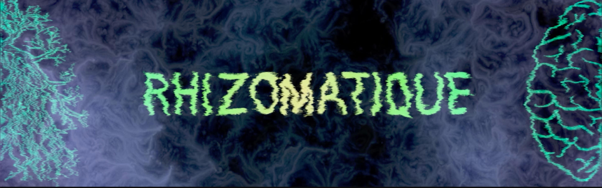
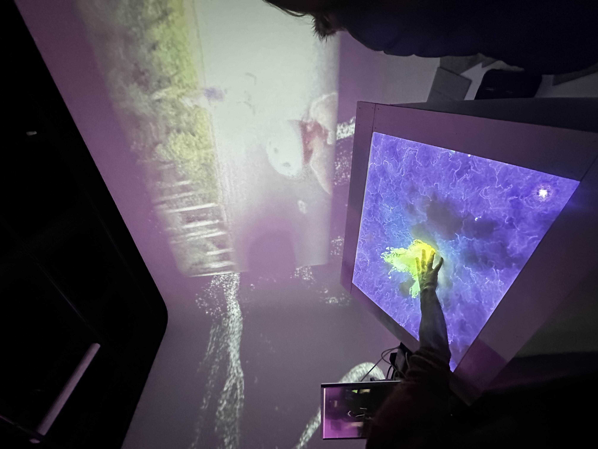
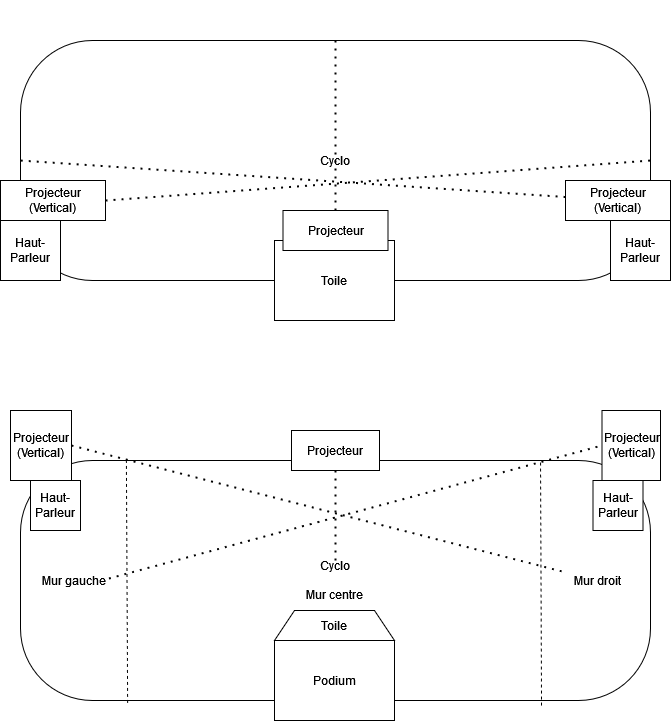

# Projet 1: Rhizomatique - l'humain et le temps

 
 
 **Créateurs**: Jolyanne Desjardins, Maïka Désy, Laurie Houde & Félix Testa Radovanovic  
 
 **Lien avec Crescentia**: Le concept de Crescentia met en avant l'évolution sous plusieurs facettes, incluant l'aspect organique,  environnemental et psychologique. "Rhizomatique" explore cette idée en reliant l'humain et le temps. Ce projet met en lumière la croissance et l'évolution des souvenirs, qui se manifestent de manière dynamique et changeante au gré des interactions des visiteurs. 
 
  **Installation en cours**: 

Cette exposition fascinante offre une expérience immersive unique, mettant en scène une toile qui symbolise le "cerveau", servant de lien entre l'interacteur et les souvenirs, ainsi que des projections immersives présentées à travers des vidéos. La toile joue également un rôle crucial en contrôlant la clarté des souvenirs, les rendant visibles sous forme de particules. À mesure que l'interaction avec la toile s'intensifie, la netteté des souvenirs s'accroît. Cette toile, métaphore du cerveau, projette des fluides et évoque l'aspect rhizomatique de cette structure complexe.

  
 **Schéma de l'installation prévue**: 

Voici le schéma initial utilisé par l’équipe. On remarque qu’ils avaient prévu d’utiliser 3 projecteurs. Cependant, lors de l’exposition, ils ont dû augmenter ce nombre à 6 car trois n'étaient pas suffisants pour leur œuvre. En dehors de cette modification, le reste du plan semble avoir été suivi selon les attentes.

 
 **Recenti Anticipé**: 
 

