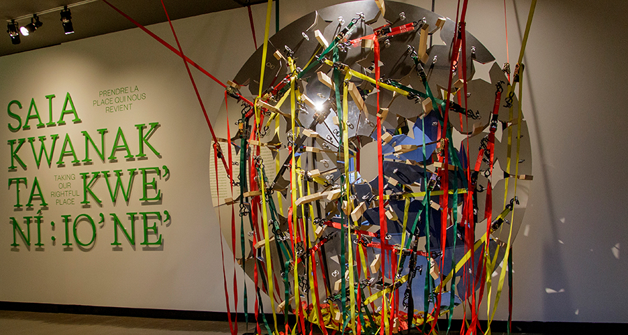

# Présentation Orale : Exposition (Wampum numérique,fin) "Voix Autochtones d'Aujourd'hui : Savoir, Trauma, Résilience"

## Introduction : 

Bonjour à tous,

Aujourd'hui, je vais partager avec vous mon expérience de l'exposition "Voix Autochtones d'Aujourd'hui : Savoir, Trauma, Résilience" présentée au Musée McCord. Cette présentation vise à explorer les thèmes fascinants abordés dans cette exposition et à partager les impressions que j'ai ressenties lors de ma visite.

## Informations sur l'Exposition et le Musée McCord : 
L'exposition "Voix Autochtones d'Aujourd'hui : Savoir, Trauma, Résilience" est une exposition permanente présentée au Musée McCord à Montréal. Elle met en lumière la diversité et la richesse des cultures autochtones tout en explorant les défis et les triomphes auxquels elles ont fait face.

