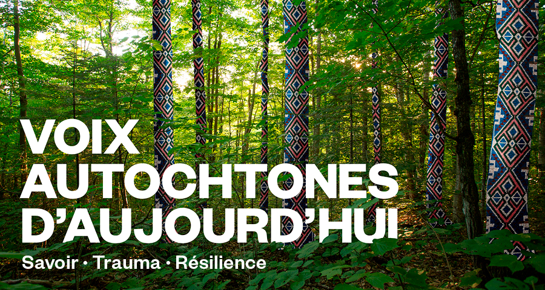
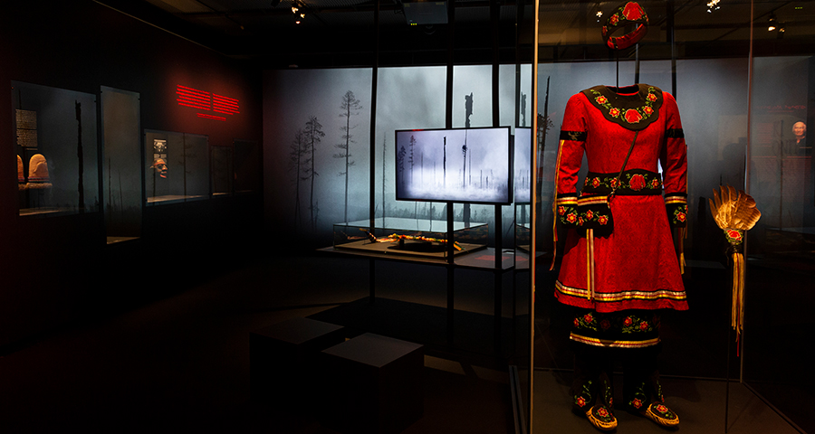
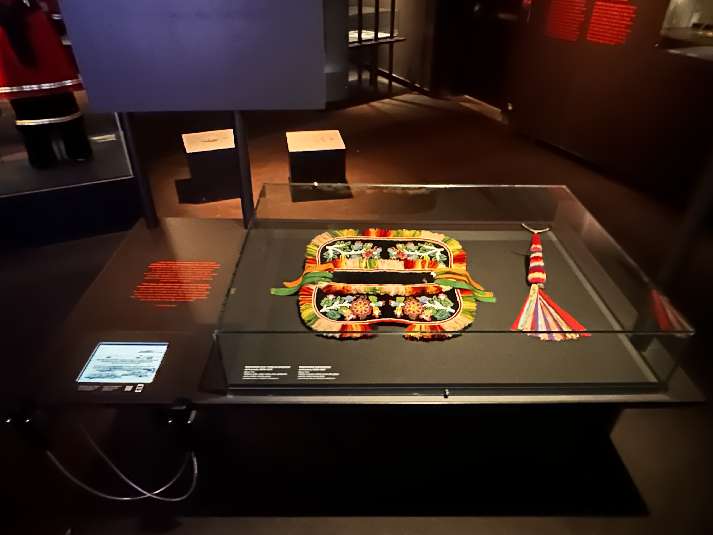
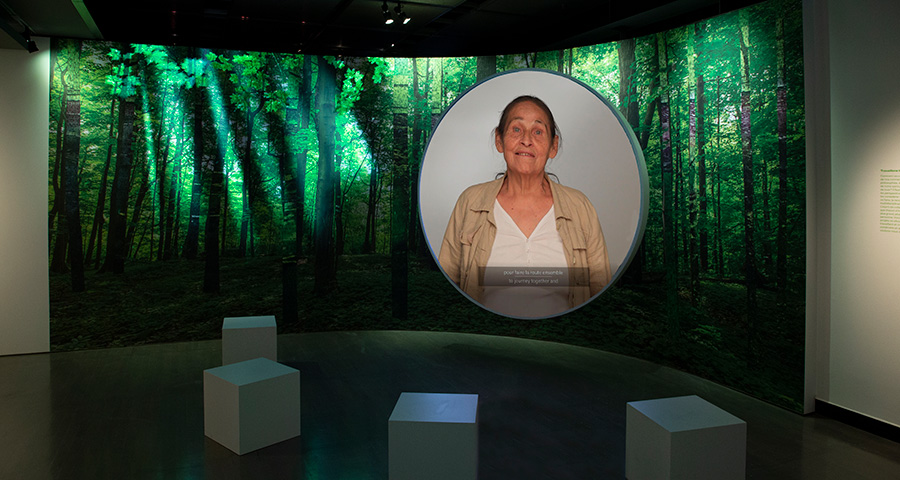
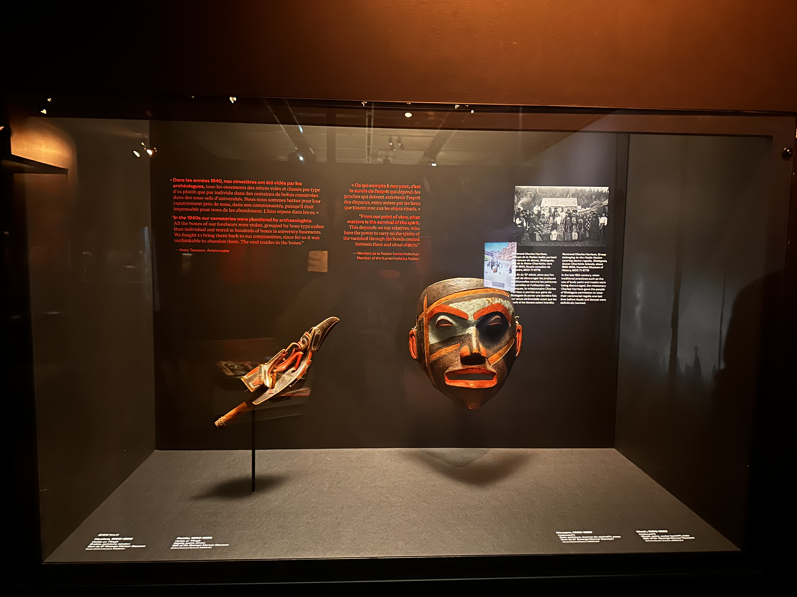

# Présentation Orale : Exposition (Wampum numérique,fin) "Voix Autochtones d'Aujourd'hui : Savoir, Trauma, Résilience"

## Introduction : 

Bonjour à tous,

Aujourd'hui, je vais partager avec vous mon expérience de l'exposition "Voix Autochtones d'Aujourd'hui : Savoir, Trauma, Résilience" présentée au Musée McCord. Cette présentation vise à explorer les thèmes fascinants abordés dans cette exposition et à partager les impressions que j'ai ressenties lors de ma visite.

## Informations sur l'Exposition et le Musée McCord : 
L'exposition "Voix Autochtones d'Aujourd'hui : Savoir, Trauma, Résilience" est une exposition permanente présentée au Musée McCord à Montréal. Elle met en lumière la diversité et la richesse des cultures autochtones tout en explorant les défis et les triomphes auxquels elles ont fait face.

## Présentation Détaillée des Œuvres et Dispositifs Multimédias : 

Cette exposition présente une variété d'œuvres d'art, d'artefacts historiques et de dispositifs multimédias. Elle est divisée en deux sections thématiques: l’entrée avec une exposition plus éclairée et la fin avec le wampum numérique dans un cadre plus sombre, explorant le savoir autochtone, l'héritage culturel, le traumatisme historique et la résilience communautaire. Parmi les œuvres remarquables, on trouve des photographies, des sculptures, des vidéos et des installations interactives, toutes témoignant de la vitalité et de la résilience des communautés autochtones.

## Expérience vécue : 

Lors de ma visite, j'ai été profondément touchée par la puissance émotionnelle des œuvres exposées. La représentation authentique des perspectives autochtones m'a permis de mieux comprendre les défis auxquels ces communautés ont été confrontées, tout en célébrant leur résilience et leur force. J’ai particulièrement apprécié l'état impeccable des objets présentés ainsi que les témoignages touchants diffusés. Ils illustrent avec une profondeur émouvante les blessures profondes que ces communautés portent, mais aussi leur incroyable résilience.

## Appréciation Critique et Justifications :

Cette exposition illustre de manière frappante l'importance de donner la parole aux communautés autochtones et de reconnaître leur contribution à la richesse culturelle du Canada. Parmi ses points forts, on peut citer la diversité des perspectives présentées, la qualité remarquable de la présentation des œuvres, l'engagement manifeste du musée à offrir une telle exposition, ainsi que l'aspect visuel et l'ambiance captivante de la salle. Participer à cette expérience m'a profondément enrichi et m'a permis d'approfondir ma compréhension de la communauté autochtone et de son histoire. Je n'ai relevé aucun aspect négatif, ayant véritablement apprécié chaque aspect de cette expérience.

