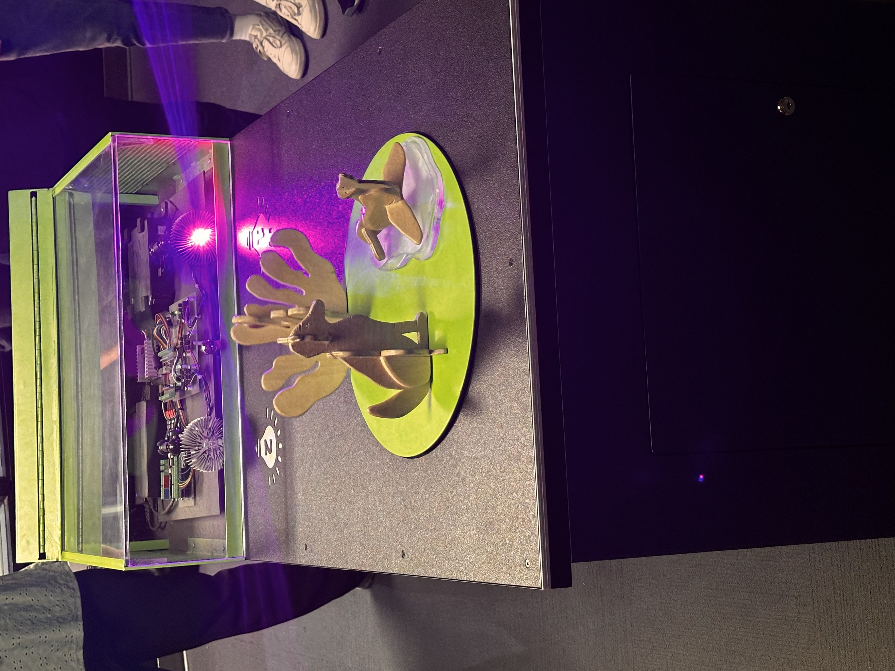

# Centre des Sciences: Un endroit pas comme les autres 

Date de la sortie : Mercredi le 10 Avril 2024

## Introduction:
La découverte du Centre des sciences de Montréal a été une expérience inoubliable, une journée très enrichissante qui m'a permis d'explorer différents dispositifs multimédia et en même temps d'apprendre de nouvelles choses. 

## Déroulement de la journée: 
Pour débuter notre journée, nous avons été accueillis par une présentation captivante d'un dispositif multimédia doté d'un mécanisme d'une complexité fascinante. Notre guide nous a transportés dans l'univers de cette exposition, nous dévoilant avec minutie les rouages et les subtilités de son fonctionnement. Avec passion, elle nous a plongés dans les coulisses de cette œuvre technologique, nous décrivant chaque étape du processus avec une clarté impressionnante.

Au fur et à mesure de ses explications détaillées, nous avons pu saisir tout le travail acharné  et la sophistication cachées derrière cette petite exposition. Grâce à notre guide, nous avons pu apprécier la complexité du mécanisme et en comprendre d'avantage sur sa fonctionnalité. Son savoir-faire nous a permis d'appréhender pleinement l'ingéniosité et le génie créatif nécessaires à la conception d'une telle installation multimédia.

